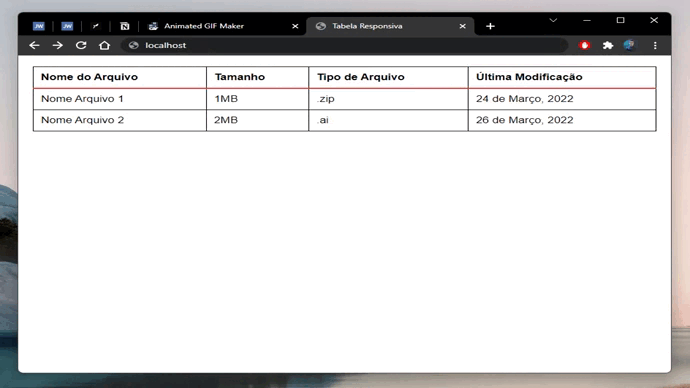

# :computer: Tabela responsiva

  

Projeto que demonstra uma maneira de deixar uma tabela responsiva apenas com HTML5 e CSS3. 

Projeto aplicado em uma tabela padrão e em uma tabela do Material UI.

## Veja rodando:
### Vanila: 

### Material UI: 

## Tecnologias:
- HTML5
- CSS3
